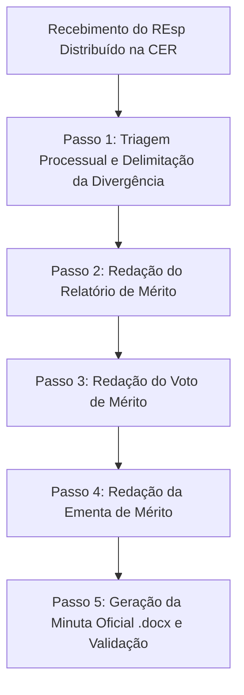

# Procedimento: Análise de Mérito de Recurso Especial (CER)

Este procedimento orienta a elaboração de minutas para o **Julgamento de Mérito de Recurso Especial (REsp)** perante a **Câmara Especial de Recursos (CER)** do Conselho de Recursos Tributários de Belo Horizonte (CRT-BH).

> **Atenção — Sigla Padrão**: Utilize exclusivamente a sigla **REsp** para se referir ao Recurso Especial e **CER** para a Câmara Especial de Recursos.

---

## 1. Visão Geral e Competência da CER

- **Órgão Julgador**: Câmara Especial de Recursos (CER), composta paritariamente por 6 (seis) conselheiros e presidida pelo Presidente do CART-BH (art. 24 do Decreto Municipal nº 19.460/2026).
- **Função Institucional**: Uniformização de jurisprudência do CRT-BH quanto à aplicação da legislação tributária municipal (art. 25, I, e art. 78 do Decreto nº 19.460/2026).
- **Efeito Devolutivo Restrito**: O recurso especial devolve à CER **apenas o julgamento da matéria objeto da divergência admitida** (art. 79 do Decreto nº 19.460/2026 e art. 67 do Decreto nº 18.783/2024). A CER não atua como terceira instância ordinária para reexame amplo de fatos e provas.
- **Liberdade Decisória**: O recurso especial não vincula a CER à adoção de qualquer dos acórdãos em confronto, podendo o Colegiado uniformizador adotar fundamentação ou entendimento diverso (art. 79, parágrafo único, do Decreto nº 19.460/2026).

---

## 2. Fluxo de Trabalho em 5 Passos

---

### Passo 1: Triagem Processual e Delimitação da Divergência Admitida

Antes de redigir qualquer peça, o assessor deve mapear detalhadamente os autos:

1. **Identificação das Decisões Ordinárias**:
   - **Decisão de 1ª Instância (JJT)**: teor da resolução da Junta de Julgamento Tributário (quais pedidos foram deferidos, indeferidos ou cancelados).
   - **Acórdão Recorrido (Câmara de Julgamento do CRT)**: acórdão proferido pela 1ª, 2ª ou 3ª Câmara, identificando os recursos apreciados (Recurso Voluntário e/ou Reexame Necessário) e os fundamentos determinantes dos votos vencedor e vencido.
2. **Exame da Decisão de Admissibilidade e Delimitação Temática**:
   - Mapear os exatos termos da decisão que admitiu o REsp: se a admissão foi integral ou **parcial**.
   - Quando a admissibilidade for parcial, identificar com precisão os tópicos admitidos e aqueles que foram rejeitados. **Os capítulos inadmitidos precluem**, sendo vedada sua rediscussão na CER.
3. **Identificação do Acórdão Paradigma e Verificação de Irrecorribilidade**:
   - Número do acórdão paradigma, Câmara julgadora prolatora e data de publicação no DOM.
   - **Verificação Histórica da Irrecorribilidade**: Verificar se o acórdão paradigma foi objeto de recurso perante a CER (como Recurso de Revista sob regulamentos antigos ou Recurso Especial sob os atuais). Caso tenha havido julgamento pela CER reformando parcialmente o paradigma, certificar e delimitar que a parcela reformada **não atingiu a tese jurídica que motivou o cabimento do REsp**, mantendo-se a sua irrecorribilidade no ponto controvertido.
4. **Mapeamento das Provas e Elementos Materiais do Caso**:
   - Identificar no processo administrativo (PTA) as páginas e cláusulas contratuais, demonstrativos fiscais ou documentos constitutivos relevantes para a subsunção da tese.
   - Verificar se há manifestações ou condutas anteriores da própria parte que reconheçam a natureza jurídica da obrigação (ex.: quitação espontânea de rubricas conexas ou admissão factual na petição de impugnação).

---

### Passo 2: Elaboração do Relatório de Mérito na CER

O Relatório de mérito do REsp perante a CER deve ser neutro, cronológico, denso e articulado em prosa contínua (sem bullet points), observando a seguinte estrutura:

1. **Cabeçalho Oficial**: Conselho, CER, número do REsp, PTA (com barra e hífen), assunto, partes, patronos e Relator.
2. **Abertura Padrão**:
   > "Versam os autos sobre Recurso Especial nº [Nº] interposto em [DATA] por [NOME EM MAIÚSCULAS] [(CNPJ/CPF nº X)], com fundamento no [art. 78 do Decreto nº 19.460/2026 / ou art. 66 do Decreto nº 18.783/2024], contra o Acórdão nº [Nº] proferido pela [CÂMARA DE ORIGEM] do Conselho de Recursos Tributários (CRT-BH), nos autos do Processo Tributário Administrativo nº [Nº] [especificar se houve RV e RN], em razão de alegada divergência jurisprudencial com o Acórdão paradigma nº [Nº PARADIGMA] proferido pela [CÂMARA PARADIGMA] deste Conselho."
3. **Histórico da Ação Fiscal e Lançamento**: TIAF instaurado em [DATA], período fiscalizado, TVF e AITIs lavrados (obrigação principal e acessória), rubricas contábeis/fatos geradores e notificação do sujeito passivo.
4. **Reclamação Administrativa e Decisão da JJT**: Teses defensivas, réplica fiscal e resultado do julgamento em 1ª instância.
5. **Julgamento na Câmara de Julgamento de Origem**:
   - Identificação dos recursos julgados (Recurso Voluntário e Reexame Necessário — **atenção**: nunca usar "provimento" para reexame necessário, mas sim reforma ou manutenção da decisão *a quo*).
   - Síntese dos votos vencedor e vencido.
   - **Transcrição literal e obrigatória do trecho da ementa (com a verbetação/cabeçalho) do Acórdão Recorrido**, restrita ao ponto objeto da divergência admitida.
6. **Razões do Recurso Especial e Acórdão Paradigma**:
   - Tese do recorrente e cotejo analítico apresentado.
   - **Transcrição literal e obrigatória do trecho da ementa (com a verbetação/cabeçalho) do Acórdão Paradigma**, restrita ao capítulo divergente.
   - **Ressalva de Irrecorribilidade do Paradigma**: Registrar expressamente se o paradigma foi objeto de recurso na CER e delimitar que a parte mantida e tornada irrecorrível é a que embasa a divergência.
7. **Marcos Temporais Neutros (Vedado o Juízo de Tempestividade no Relatório)**:
   - Indicar estritamente as datas dos fatos processuais (data de publicação do acórdão recorrido no DOM e data do protocolo do REsp). O juízo de tempestividade é matéria exclusiva do Voto.
8. **Decisão de Admissibilidade**:
   - Registrar os exatos termos da decisão de admissibilidade (admissão parcial ou total, capítulos admitidos e rejeitados, e a irrecorribilidade do provimento prévio).
9. **Contrarrazões / Manifestação da Parte Recorrida**:
   - Resumir a manifestação da parte contrária (Fisco ou Contribuinte), inclusive preliminares arguidas, ou registrar o decurso *in albis*.
10. **Distribuição e Fecho**:
    - "Distribuídos os autos a este Conselheiro Relator no âmbito da Câmara Especial de Recursos (CER) para o julgamento da matéria admitida."
    - **"É o relatório."** (isolado, sem negrito).

---

### Passo 3: Elaboração do Voto de Mérito na CER

O Voto expressa o convencimento motivado do Relator, redigido com autoridade, linguagem sóbria, desprovida de adjetivos hiperbólicos e na primeira pessoa do singular:

1. **Abertura do Voto (Delimitação Direta do Objeto — Sem "Versam os autos")**:
   - **NUNCA** iniciar o Voto de REsp com a fórmula *"Versam os autos"*.
   - Abrir delimitando diretamente o objeto do contencioso:
     > "O presente julgamento tem por objeto a apreciação do mérito do Recurso Especial nº [Nº], interposto por [NOME DA PARTE] contra o Acórdão nº [Nº] proferido pela [CÂMARA DE ORIGEM] do Conselho de Recursos Tributários (CRT-BH), que [resumo do resultado do acórdão recorrido em relação à matéria admitida]."
2. **Da Delimitação do Efeito Devolutivo e Vinculação à Admissibilidade**:
   - Assentar que a cognição da CER está adstrita aos limites temáticos da decisão de admissibilidade.
   - Registrar a preclusão consumativa dos tópicos recursais que foram expressamente rejeitados na admissibilidade.
3. **Afastamento de Preliminar de Não Conhecimento (Regra de Direito Intertemporal quando aplicável)**:
   - Caso a parte recorrida suscite preliminar de não conhecimento pretendendo rediscutir o cabimento do REsp na sessão de julgamento:
     * **Se o REsp foi interposto antes do Decreto nº 19.460/2026 (sob o Decreto nº 18.783/2024)**: Aplicar o princípio do *tempus regit actum* e a Teoria do Isolamento dos Atos Processuais (art. 14 do CPC c/c art. 336 da Lei Municipal nº 1.310/1966). A admissibilidade consumou-se sob a égide do art. 68, parágrafo único, do Decreto nº 18.783/2024, que vedava expressamente a sua reapreciação na sessão de julgamento da CER. Tratando-se de ato processual perfeito e acabado com preclusão *pro judicato*, norma procedimental superveniente não pode retroagir.
     * **Se o REsp foi interposto sob o Decreto nº 19.460/2026**: A competência de admissibilidade pertence à Câmara de Presidentes (art. 28, I), cujas decisões são irrecorríveis (art. 29), devolvendo-se à CER apenas o julgamento da divergência admitida (art. 79). A CER não possui competência revisora sobre a admissibilidade positiva proferida pelo órgão competente.
4. **Do Mérito (Uniformização Jurisprudencial e Subsunção Tributária)**:
   - **Enfrentamento Dialético da Decisão de Admissibilidade**: Examinar se o acórdão recorrido de fato dissentiu da diretriz hermenêutica do paradigma, ou se aplicou a mesma *ratio decidendi* sobre substrato fático diverso.
   - **Exame da Atividade-Fim típica vs. Prestações Acessórias/Modais**: Analisar a causa do negócio jurídico (art. 110 do CTN). Se a atividade principal for prestação de serviços (obrigação de fazer tributável pelo ISSQN), estipulações acessórias (como bônus, exclusividades ou cláusulas penais) não se autonomizam como "obrigação de dar", integrando o preço do serviço (art. 7º da LC nº 116/2003 e arts. 5º e 6º da Lei Municipal nº 8.725/2003).
   - **Indicação das Provas dos Autos**: Citar expressamente folhas do PTA, contratos e cláusulas pertinentes.
   - **Comportamento das Partes**: Ressaltar eventuais pagamentos ou reconhecimentos anteriores da incidência tributária sobre rubricas correlatas.
   - **Sobriedade Linguística**: Redação límpida, técnica e neutra, eliminando adjetivos e advérbios hiperbólicos (*"desenganadamente"*, *"extraordinariamente"*, *"umbilicalmente"*, *"absoluta"*, *"barreira intransponível"*).
5. **Conclusão e Dispositivo**:
   - Voto formal pelo provimento ou desprovimento do REsp:
     > "Por todo o exposto, afasto a preliminar de não conhecimento suscitada pela [Fazenda Pública / Recorrida] e, no mérito, **voto pelo [PROVIMENTO / DESPROVIMENTO] do Recurso Especial nº [Nº]**, [dispositivo final com indicação dos AITIs e rubricas]."
   - "Belo Horizonte, data da assinatura eletrônica."

---

### Passo 4: Redação da Ementa de Mérito

A ementa sintetiza a tese jurídica uniformizada pela CER, seguindo o padrão de indexação do CRT-BH:

1. **Cabeçalho da Ementa em Caixa Alta e Negrito**:
   - **Abertura Obrigatória pelo Objeto do Julgamento**: `RECURSO ESPECIAL – MÉRITO – CÂMARA ESPECIAL DE RECURSOS...` (nunca abrir pelo tributo).
   - Encadeamento: Objeto recursal → delimitação da admissibilidade/preclusão → critério normativo de subsunção → qualificação da atividade-fim do contrato → tributo/subitem da lista → acessoriedade de cláusulas/preço do serviço → fundamentação legal → resultado.
2. **Corpo em Bullets com Hífens (-)**:
   - Bullet 1: Cognição vinculada e preclusão dos capítulos inadmitidos.
   - Bullet 2: Tese central da *ratio decidendi* do paradigma e sua aplicação ao caso concreto.
   - Bullet 3: Qualificação da atividade-fim contratual e impossibilidade de cisão de cláusulas acessórias/modais.
   - Bullet 4: Definição da base de cálculo (preço do serviço abrangendo vantagens contratuais diretas e indiretas).
   - Bullet 5: Resultado final ("Recurso Especial desprovido" ou "Recurso Especial provido").

---

### Passo 5: Geração da Minuta Oficial em Word (.docx) e Validação

1. **Modelo Oficial**: Utilizar `templates/modelo-agravo.docx` herdando estilos, timbres e rodapés oficiais.
2. **Quebras de Página**: Inserir `page_break_before = True` no primeiro parágrafo do cabeçalho de cada seção (VOTO e EMENTA começam sempre no topo de página nova).
3. **Citações em Bloco**: Aplicar recuo à esquerda de 2,0 cm em itálico (`left_indent = Cm(2.0)`, `italic = True`) para transcrições literais de ementas, petições e cláusulas contratuais.
4. **Compatibilidade Estrita com Google Docs**:
   - Manter seção única `<w:sectPr>` contendo apenas `header1.xml` (default) e `footer1`/`footer2`.
   - Purgar quaisquer arquivos órfãos (`header2`, `header3`, `footer3`) e garantir que `word/_rels/header1.xml.rels` aponte corretamente para `media/image1.png`.
5. **Validação de Conformidade**:
   - Executar `python scripts/office/validate.py minuta.docx` (deve retornar `All validations PASSED!`);
   - Executar smoke test de conversão PDF via LibreOffice headless.
   - Salvar o arquivo oficial na pasta do processo.
